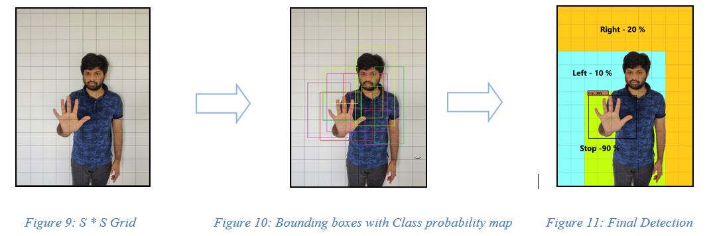
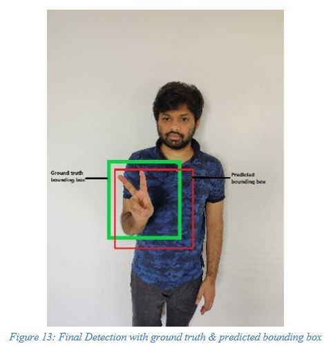
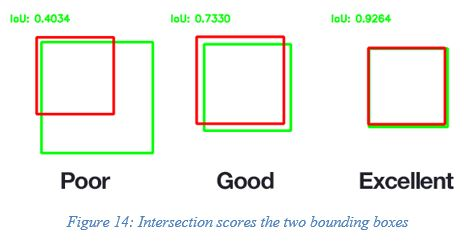
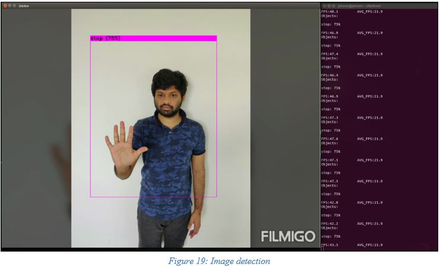
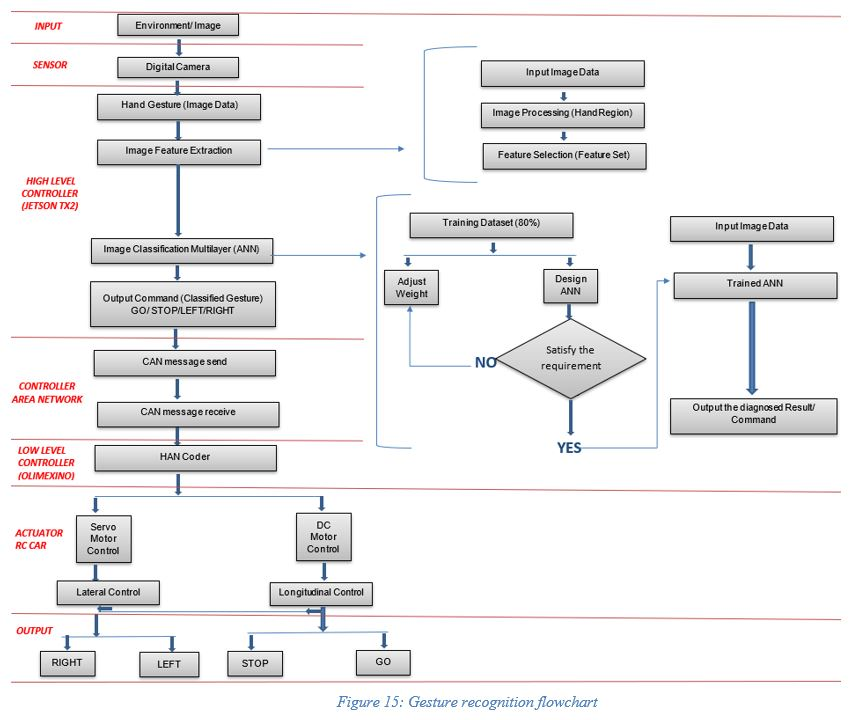

# Road User Semantics- Pedestrian Hand Gesture recognition using Darknet (YOLO)

The real-time gesture recognition system is developed accordance with the objective of ADAS which is to make cars safer to drive and assist driver in the driving process.  
Pedestrian-to-car communication in which the self-driving car (SDC) must understand the pedestrian’s intent in negotiating the right of way, for example a pedestrian may give up his/her right of way by using a hand gesture to signal the Autonomous Vehicle (AV) to proceed first at an intersection is crucial.  
Finally we present a SAE Level 3 ADAS technology for pedestrian hand gesture recognition by a reduced scaled car model. This was achieved by successfully synchronizing the given Nvidia Jetson TX2 unit (high-level controller) via CAN protocol with the Olimexino STM32 (low level controller). 


## Getting Started

Darknet is an open source Neural Network framework which is written in 'C' Language and CUDA technology, which makes it fast and allows computation using GPU for real time object detection. In our project we have implemented YOLO alogorithm for detecting the hand gestures.
<p>
YOLO model is a one-shot learner, meaning each image only passes through the network once to make a prediction, which allows the architecture to be very performant, it can process up to 60 frames per second in predicting against video feeds and set of images. YOLO divides an image into subcomponents and conducts convolutions on each of those subcomponents before pooling back to create a prediction.</p>  
<p>
The image or video is divided into S * S grid of cells. For gesture presented on the image, each grid of cell predicts a bounding box with the class probability. The predicted bounding boxes has 5 components (x,y,w,h,confidence). In this (x,y) coordinates represents the center of the bounding box. The (w,h) represents the height and width of the cell grids combined and confidence score which reflects the presence or absence of an object of any class. </p>  
  
<p>
  To measure the accuracy of an object detector and to determine the exact position of the object, a simple approach called Intersection over Union (IoU) is used. To evaluate the accuracy of the detector, the ground truth bounding box and predicted bounding box is needed.
  </p>  
     
  <p>The red box indicates the predicted bounding box and the green box indicates the ground truth box (Hand labelled). IoU is computed from the ratio of area of overlap between the two bounding boxes. </p>


### Prerequisites

In order to run Darknet, the following software dependencies are required:  
  CUDA 10.0  
  cuDNN 7.0  
  OpenCV 4.1  


Darknet files are copied to local computer using the following commands.
```
git clone https://github.com/pjreddie/darknet.git
```    
Now, few changes have to be made in MakeFile under the Darknet directory    
`GPU=1` to build with CUDA to accelerate by using GPU (CUDA should be in `/usr/local/cuda`)  
`CUDNN=1` to build with cuDNN v5-v7 to accelerate training by using GPU (cuDNN should be in `/usr/local/cudnn`)  
`CUDNN_HALF=1` to build for Tensor Cores (on Titan V / Tesla V100 / DGX-2 and later) speedup Detection 3x, Training 2x  
`OPENCV=1` to build with OpenCV 4.x/3.x/2.4.x - allows to detect on video files and video streams from network cameras or web-cams  
    
  After making changes in the Makefile, run the below command to build executable programs and libraries from source code.  
```
make
```

### Preparation of Custom dataset, Classification and Labelling

For the detector to learn to recognize gestures, such as ‘stop’, ‘go’, ‘left’ and ‘right’ from images, it needs to be fed with labelled training data. To do so, about 120 images under various lighting conditions of all the classes are considered.  
The labelling and annotation of these images were saved in .txt file using the software Labellmg.  
A sample dataset is shown below:  
  

  
### Training of Custom dataset  
In the next step the above custom dataset is trained in JETSON TX2. The weight files were generated for both TOLOV3, YOLOV3 TINY and YOLOV4. Finally, it was decided to use YOLOV3_TINY due to its lower computational GPU usage and faster training.   
The weight files can be downloaded [here](https://drive.google.com/drive/folders/1aZD_CfDZBYE4Ir5AvfCp_YuWwS9ja5Ab?usp=sharing)  
To train for the custom dataset few minor changes must be made in configuration (cfg) file.  
  &nbsp;&nbsp;&nbsp;&nbsp;	Number of classes = 4 (Stop, Right, Left, Go)  
  &nbsp;&nbsp;&nbsp;&nbsp;	Batch = 8000 (Number of classes * 2000) The number of images chosen in each batch to reduce loss  
  &nbsp;&nbsp;&nbsp;&nbsp;	Subdivisions = 8 (division of batch size to number of sub batches for parallel processing)  
  &nbsp;&nbsp;&nbsp;&nbsp;	Filters = 27 ((classes + 5) *3)  
    
  To train the object detector, an existing pre-trained weight that are already trained on huge data sets is considered for better accuracy (darknet53. conv. weight).  
  Link to download pre-trainied weight [here](https://pjreddie.com/media/files/darknet53.conv.74)  

Start the training by using the command line:
```
./darknet detector train data/obj.data cfg/yolov3_custom.cfg darknet53.conv.74
```
or Use this command for YOLO_TINY model.   

```
./darknet detector train data/obj.data cfg/yolov3_custom_tiny.cfg darknet53.conv.74
```


## Testing the Algorithm using Onboard Jetson Camera.
  
```
./darknet detector demo data/obj.data cfg/yolov3_tiny.cfg yolov3_tiny.weights "nvarguscamerasrc ! video/x-raw(memory:NVMM), width=(int)1280, height=(int)720,format=(string)NV12, framerate=(fraction)30/1 ! nvvidconv flip-method=0 ! video/x-raw, format=(string)BGRx ! videoconvert ! video/x-raw, format=(string)BGR ! appsink"
```  
<p>
  The results of the detection is as shown below:  
    


### Flowchart of working of Hand Gesture Recognition  
   
 
<p>The performance of the proposed method highly depends on the results of the hand gesture detection, which was improved from a low Frames per second (FPS) to relatively high FPS at the end of the project.</p>

### FUTURE SCOPE AND RECOMMENDATIONS

<p>Following are a few recommendations and suggestions which can be done to extend on the research done so far on pedestrian hand gesture recognition system </p>  
<p>&nbsp;&nbsp;&nbsp;&nbsp;&nbsp;&nbsp;	Current research was carried out for static hand gestures (images). This can be extended to dynamic hand gestures (video/real-time motion) by doing the required changes to the algorithm, code and logic.</p>  
<p>&nbsp;&nbsp;&nbsp;&nbsp;&nbsp;&nbsp; 	For improved performance and full proof safety of the ADAS hand gesture recognition technology, Lane follower along with steering control can be integrated in the existing system.  </p>  
<p>&nbsp;&nbsp;&nbsp;&nbsp;&nbsp;&nbsp; 	For this project, we send/received single CAN message between the controllers to control the actuators based the logic in low level controller. However, multiple CAN messages can be sent to control the actuators DC motor/Servo motor) to reduce the complexity of the logic by making use of the CAN property.  </p>  


## Author

* **VIVEK GOURAV S** - *Initial work* - [DaRkCoN](https://github.com/vivekgourav)

See also the list of [contributors](https://github.com/vivekgourav/Static-Hand-Gesture-Recognition-using-YOLO/blob/master/contributors/team.txt) who participated in this project.

## License

This project is an open source and can be used by anyone.

## Acknowledgments

We would like to express our appreciation to the HAN Automotive Research group and the Smart Vehicles module course co-ordinators and instructors <b>Chris Huijboom, Rakshith Kusumakar and Marith Dieker </b>for the guidance, support and motivation at necessary junctures of the project. Special Thanks to our supervisor Rakshith Kusumakar for providing timely feedback on the milestones our group achieved during the process and completion of the project. Lastly, we would like to thank our family, friends and colleagues who supported and helped us directly or indirectly for successfully completing the project.

## Credits:  

  [Darknet](https://github.com/AlexeyAB/darknet)  
  [HANcoder/Training Material/SmartCar](http://openmbd.com/wiki/HANcoder/Training_Material/SmartCar)      
  [YOLOV3 Beginner Guide](https://towardsdatascience.com/dive-really-deep-into-yolo-v3-a-beginners-guide-9e3d2666280e)      
  [Understanding YOLO](https://hackernoon.com/understanding-yolo-f5a74bbc7967)      
  [YOLO Algorithm](https://appsilon.com/object-detection-yolo-algorithm/)      
  [IoU For Object Detection](https://www.pyimagesearch.com/2016/11/07/intersection-over-union-iou-for-object-detection/)  
  [Custom Object Detection](https://blog.francium.tech/custom-object-training-and-detection-with-yolov3-darknet-and-opencv-41542f2ff44e)   
  
  
  
 
